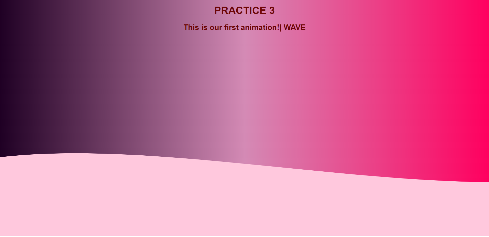

# Practice-3
This is the first joint beginning work of Kaukenova Karina and Yeskermes Aman.
To begin with, we want to thank you for checking and evaluating our page.
We used basic understanding of HTML, CSS, JavaScript to write this work.

This is a solution to the [Ping coming soon page challenge on Frontend Mentor](https://www.frontendmentor.io/challenges/ping-single-column-coming-soon-page-5cadd051fec04111f7b848da). Frontend Mentor challenges help you improve your coding skills by building realistic projects. 

## Table of contents

- [Overview](#overview)
  - [The challenge](#the-challenge)
  - [Screenshot](#screenshot)
- [My process](#my-process)
  - [Built with](#built-with)
  - [What I learned](#what-i-learned)
  - [Useful resources](#useful-resources)
- [Author](#author)

## Overview

### The challenge
Do the task using css animation. Change the design as you want. Add features and make it more creative.

### Screenshot

This is a screenshot of our solution.



### Built with

- Semantic HTML5 markup
- CSS custom properties
- Animation

### What We learned
We have learned how to use all these tools correctly. How to correctly prioritize when compiling a website. You can see important examples below.

Snippets:

```html
 <linearGradient id="gradient1" x1="100%" y1="0%" x2="100%" y2="0%">
        <stop offset="100%" stop-color="#ffc8dd" />
      </linearGradient>
```
```css
.waves svg{
  position: absolute;
  width: 100%;
  bottom: 0;
  left: 0;
  animation-name: move-left;
  animation-duration: 1s;
  animation-iteration-count: infinite;
}
```
### Useful resources

- [SVG](http://www.w3.org/2000/svg)

## Author
- Karina Kaukenova: [@kar11nko](https://github.com/kar11nko)
- Amenov Yernar:  [@madhoma01](https://github.com/madnomad01)

